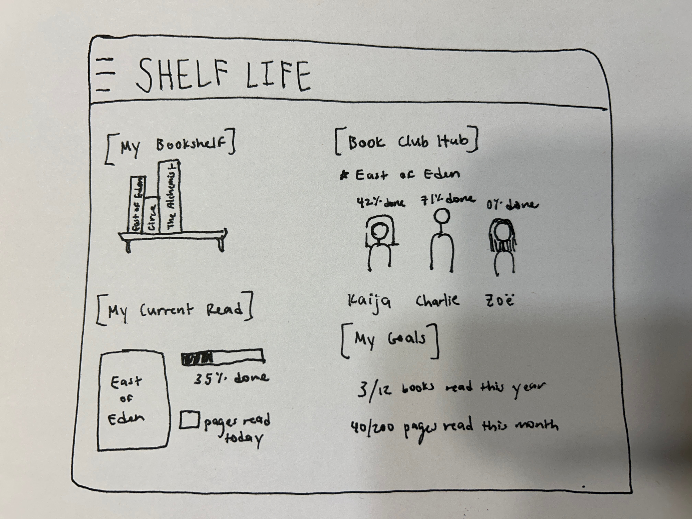

# ShelfLife

[My Notes](notes.md)

This application will track reading between friends. A user can use the ShelfLife app to keep track of books they are currently reading, books on their to be read list, goals they have for how much they want to read every day, and progress they are making on their current read. Additionally, friends can read books together and keep track of each other's progress to stay accountable to their reading goals. The Open Library API will be used to retrieve book information and cover images.

### Elevator pitch

In a world full of so many distractions and technological demands, reading is becoming a lost art. Many of us want to be reading more frequently, but lack accountability or lose track of books that we've been wanting to read. Not anymore! Shelf Life is a reading tracker app that helps you track your reading goals, document which books you've read throughout the year, and compare your progress to your friends. It's like an online book club that can be as personal or as community-based as you want it to be.

### Design

### Key features

- Secure login over HTTPS
- Ability for user to add new books to their bookshelf
- User can create a to-read list and view which books they have already read in the year
- User can select their current read and track their progress on it daily
- Book club feature to track each friend's progress on the same book
- Ability to update daily how many pages user has read
- Goal section to track how many books the user wants to read in a year and how many days a month they want to read

### Technologies

I am going to use the required technologies in the following ways.

- **HTML** - Uses correct HTML structure for application. One for login, one for homepage, potential sections for the year-to-date bookshelf, current book's tracking and progress, book club hub for friends' tracking progress, and goal page.
- **CSS** - Application styling that looks good on different screen sizes, has colorful options for the various books on the bookshelf, and displays segments of the dashboard in a visually appealing way.
- **React** - Provides login, book display, and use of React for inputting new books, selecting friends, and updating goals.
- **Service** - Backend service with endpoints for login, retrieving friends' progress, updating user's progress, and updating goals.
- **DB/Login** - Store users, booklists, goals, and friends lists in database. Register and login users. Credentials securely stored in database. Cannot update booklist or progress unless authenticated.
- **WebSocket** - As each user updates their progress on a given book, their progress is updated for each of their friends.
- **3rd party API** - The 3rd party API I will be using is Open Library API to search and display book titles and covers.

[Open Library API Link](https://openlibrary.org/developers/api)

## 🚀 Specification Deliverable

> [!NOTE]
> Fill in this sections as the submission artifact for this deliverable. You can refer to this [example](https://github.com/webprogramming260/startup-example/blob/main/README.md) for inspiration.

For this deliverable I did the following. I checked the box `[x]` and added a description for things I completed.

- [x] I completed the prerequisites for this deliverable (Git commit requirement)
- [x] Proper use of Markdown
- [x] A concise and compelling elevator pitch
- [x] Description of key features
- [x] Description of how you will use each technology including your 3rd party API and use of WebSocket
- [x] One or more rough sketches of your application. Images must be embedded in this file using Markdown image references.

## 🚀 AWS deliverable

For this deliverable I did the following. I checked the box `[x]` and added a description for things I completed.

- [x] **Rented EC2 server** - I did not complete this part of the deliverable.
- [x] **Leased domain name** - I did not complete this part of the deliverable.
- [x] **Server accessible** from my domain: [https://shelflife.click](https://shelflife.click) - I did not complete this part of the deliverable.

## 🚀 HTML deliverable

For this deliverable I did the following. I checked the box `[x]` and added a description for things I completed.

- [ ] I completed the prerequisites for this deliverable (Simon deployed, GitHub link, Git commits)
- [ ] **HTML pages** - I did not complete this part of the deliverable.
- [ ] **Proper HTML element usage** - I did not complete this part of the deliverable.
- [ ] **Links** - I did not complete this part of the deliverable.
- [ ] **Text** - I did not complete this part of the deliverable.
- [ ] **3rd party API placeholder** - I did not complete this part of the deliverable.
- [ ] **Images** - I did not complete this part of the deliverable.
- [ ] **Login placeholder** - I did not complete this part of the deliverable.
- [ ] **DB data placeholder** - I did not complete this part of the deliverable.
- [ ] **WebSocket placeholder** - I did not complete this part of the deliverable.

## 🚀 CSS deliverable

For this deliverable I did the following. I checked the box `[x]` and added a description for things I completed.

- [ ] I completed the prerequisites for this deliverable (Simon deployed, GitHub link, Git commits)
- [ ] **Visually appealing colors and layout. No overflowing elements.** - I did not complete this part of the deliverable.
- [ ] **Use of a CSS framework** - I did not complete this part of the deliverable.
- [ ] **All visual elements styled using CSS** - I did not complete this part of the deliverable.
- [ ] **Responsive to window resizing using flexbox and/or grid display** - I did not complete this part of the deliverable.
- [ ] **Use of a imported font** - I did not complete this part of the deliverable.
- [ ] **Use of different types of selectors including element, class, ID, and pseudo selectors** - I did not complete this part of the deliverable.

## 🚀 React part 1: Routing deliverable

For this deliverable I did the following. I checked the box `[x]` and added a description for things I completed.

- [ ] I completed the prerequisites for this deliverable (Simon deployed, GitHub link, Git commits)
- [ ] **Bundled using Vite** - I did not complete this part of the deliverable.
- [ ] **Components** - I did not complete this part of the deliverable.
- [ ] **Router** - I did not complete this part of the deliverable.

## 🚀 React part 2: Reactivity deliverable

For this deliverable I did the following. I checked the box `[x]` and added a description for things I completed.

- [ ] I completed the prerequisites for this deliverable (Simon deployed, GitHub link, Git commits)
- [ ] **All functionality implemented or mocked out** - I did not complete this part of the deliverable.
- [ ] **Hooks** - I did not complete this part of the deliverable.

## 🚀 Service deliverable

For this deliverable I did the following. I checked the box `[x]` and added a description for things I completed.

- [ ] I completed the prerequisites for this deliverable (Simon deployed, GitHub link, Git commits)
- [ ] **Node.js/Express HTTP service** - I did not complete this part of the deliverable.
- [ ] **Static middleware for frontend** - I did not complete this part of the deliverable.
- [ ] **Calls to third party endpoints** - I did not complete this part of the deliverable.
- [ ] **Backend service endpoints** - I did not complete this part of the deliverable.
- [ ] **Frontend calls service endpoints** - I did not complete this part of the deliverable.
- [ ] **Supports registration, login, logout, and restricted endpoint** - I did not complete this part of the deliverable.
- [ ] **Uses BCrypt to hash passwords** - I did not complete this part of the deliverable.

## 🚀 DB deliverable

For this deliverable I did the following. I checked the box `[x]` and added a description for things I completed.

- [ ] I completed the prerequisites for this deliverable (Simon deployed, GitHub link, Git commits)
- [ ] **Stores data in MongoDB** - I did not complete this part of the deliverable.
- [ ] **Stores credentials in MongoDB** - I did not complete this part of the deliverable.

## 🚀 WebSocket deliverable

For this deliverable I did the following. I checked the box `[x]` and added a description for things I completed.

- [ ] I completed the prerequisites for this deliverable (Simon deployed, GitHub link, Git commits)
- [ ] **Backend listens for WebSocket connection** - I did not complete this part of the deliverable.
- [ ] **Frontend makes WebSocket connection** - I did not complete this part of the deliverable.
- [ ] **Data sent over WebSocket connection** - I did not complete this part of the deliverable.
- [ ] **WebSocket data displayed** - I did not complete this part of the deliverable.
- [ ] **Application is fully functional** - I did not complete this part of the deliverable.
